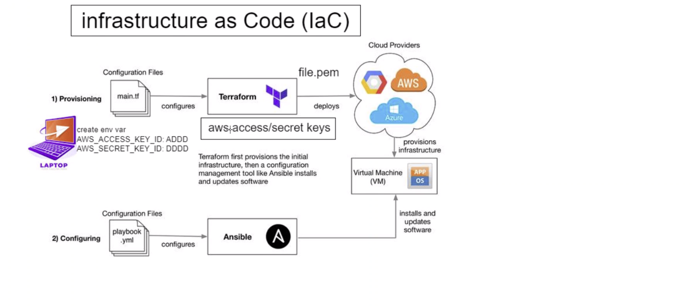

# Terraform
## What is it?
Terraform is an open-source infrastructure as code (IaC) tool developed by HashiCorp. It is used to automate the provisioning and management of cloud infrastructure and services. By defining infrastructure as code, Terraform allows users to create, modify, and delete resources in a consistent and reproducible manner.
## Why is it used?
Terraform is used to simplify and accelerate the process of setting up and managing complex cloud environments. It provides a declarative syntax for describing the desired state of the infrastructure, allowing users to version-control and collaborate on infrastructure changes efficiently.
## Benefits
Benefits of Terraform include:

Infrastructure as Code (IaC): Terraform enables the definition of infrastructure configurations in code, improving collaboration, version control, and reducing manual errors.

Platform Agnostic: It supports various cloud providers like AWS, Microsoft Azure, Google Cloud Platform, and more, as well as on-premises solutions.

Consistency: Terraform ensures that the infrastructure is always in the desired state, which improves the consistency of deployments across environments.

Automation: By automating infrastructure provisioning, Terraform reduces the time and effort required for deployment and scaling.

Scalability: Terraform allows users to scale infrastructure easily as demands grow, making it suitable for both small and large-scale projects.
## Who is using it
Companies and organizations of all sizes use Terraform for infrastructure management. Some well-known users include Airbnb, GitHub, HashiCorp, and many others across various industries.

## The architecture

- Leverage Terraform configuration files to define and deploy essential infrastructure resources within your preferred cloud provider, such as AWS, Azure, or GCP.
- Terraform guarantees the precise creation and configuration of infrastructure in accordance with the specified requirements.
- After Terraform provisions the infrastructure, seamlessly employ Ansible playbooks to manage and customize software and settings on the newly deployed resources.
- Ansible establishes connections to servers and executes playbook tasks, ensuring the desired configurations are effectively applied.

# How to download terraform
1. #### Download terraform:
   - Go to official Terraform website
   - Download the windows 64-bit version
2. Extract the archive to user folder
3. Copy Path
4. Seach environment variable on pc
5. Select environment variable at the bottom
6. Edit path
7. Add new
8. Paste path
9. Click ok to exit
10. Log into git bash of windows cli and use command ```terraform --version``` to test whether it has downloaded
11. Outcome should look like this: 

# How to launch an instance through terraform
.png>)
#### VPC with terraform
1. create vpc with cidr block 10.0.0.0/16
2. create internet gateway
3. attach to vpc
4. create subnets
5. set up public route tables
6. add routes
7. add vms
```
# launch an ec2
# which cloud - aws
# terraform downloads required dependencies
# terraform init

# provider name
provider "aws"{
       # which part of this AWS
       region = "eu-west-1"

}
# Create vpc
resource "aws_vpc" "tech241-ryan-vpc" {
  # which cidr block
  cidr_block       = "10.0.0.0/16"
  instance_tenancy = "default"

  tags = {
    Name = "tech241-ryan-vpc"
  }
}

# Internet gateway
resource "aws_internet_gateway" "tech241-ryan-igw" {
  vpc_id = aws_vpc.tech241-ryan-vpc.id

  tags = {
    Name = "tech241-ryan-igw"
  }
}

# Create a subnet within the VPC
resource "aws_subnet" "public" {
  vpc_id                  = aws_vpc.tech241-ryan-vpc.id
  cidr_block              = "10.0.2.0/24"
  availability_zone       = "eu-west-1a"
  tags = {
    Name = "public"
  }
}

resource "aws_subnet" "private" {
  vpc_id                  = aws_vpc.tech241-ryan-vpc.id
  cidr_block              = "10.0.3.0/24"
  availability_zone       = "eu-west-1b"
  tags = {
    Name = "private"
  }
}

# Create route table
resource "aws_route_table" "tech241-ryan-public-rt" {
  vpc_id = aws_vpc.tech241-ryan-vpc.id

  route {
    cidr_block = "0.0.0.0/0"
    gateway_id = aws_internet_gateway.tech241-ryan-igw.id
  }

  tags = {
    Name = "tech241-ryan-public-rt"  }
}

resource "aws_route_table_association" "my_route_table_association" {
  subnet_id      = aws_subnet.public.id
  route_table_id = aws_route_table.tech241-ryan-public-rt.id
}

# Create a security group with SSH access (modify rules as needed)
resource "aws_security_group" "tech241-ryan-tf-http-ssh-3000" {
  name_prefix = "tech241-ryan-tf-http-ssh-3000"
  vpc_id      = aws_vpc.tech241-ryan-vpc.id

  # Ingress rule to allow SSH access
  ingress {
    from_port   = 22
    to_port     = 22
    protocol    = "tcp"
    cidr_blocks = ["0.0.0.0/0"]
  }

    ingress {
    from_port   = 80
    to_port     = 80
    protocol    = "tcp"
    cidr_blocks = ["0.0.0.0/0"]
  }

    ingress {
    from_port   = 3000
    to_port     = 3000
    protocol    = "tcp"
    cidr_blocks = ["0.0.0.0/0"]
  }

  egress {
  from_port   = 0
  to_port     = 0
  protocol    = "-1"
  cidr_blocks = ["0.0.0.0/0"]
  }

  tags = {
    Name = "tech241-ryan-tf-http-ssh-3000"
  }
}

# Launch an ec2 in Ireland
resource "aws_instance" "app_instance"{

# Reference the existing SSH key pair using its name
  key_name = "tech241"

# Create a security group with SSH access (modify rules as needed)
vpc_security_group_ids = [aws_security_group.tech241-ryan-tf-http-ssh-3000.id]
  subnet_id     = aws_subnet.public.id

# which machine/OS version etc. AMI-id
  ami = "ami-06485fa6c320b0b1f"

# what type of instance
  instance_type = "t2.micro"

# is the public IP required
  associate_public_ip_address = true

# what would you like to name it
  tags = {
       Name = "tech241-ryan-terraform-app"
  }

}

```


```
resource "aws_vpc" "tech241-ryan-vpc" {
  cidr_block       = "10.0.0.0/16"
  instance_tenancy = "default"

  tags = {
    Name = "tech241-ryan-vpc"
  }
}
```

1. Create env variable on local host, one for your access key and one for secret
2. ```nano main.tf```
3.  Paste script:
```
# launch an ec2
# which cloud - aws
# terraform downloads required dependencies
# terraform init

# provider name
provider "aws"{
       # which part of this AWS
       region = "eu-west-1"

}
# Launch an ec2 in Ireland
resource "aws_instance" "app_instance"{

# which machine/OS version etc. AMI-id
  ami = "ami-0943382e114f188e8"

# what type of instance
  instance_type = "t2.micro"

# is the public IP required
  associate_public_ip_address = true

# what would you like to name it shahrukh-tech241-terraform-app
  tags = {
       Name = "tech241-ryan-terraform-app"
  }


}

```
4. ```terraform init```
5. Check script works ```terraform plan```
6. Run script ```terraform apply```
7. Delete vm and all resources created with it ```terraform destroy```